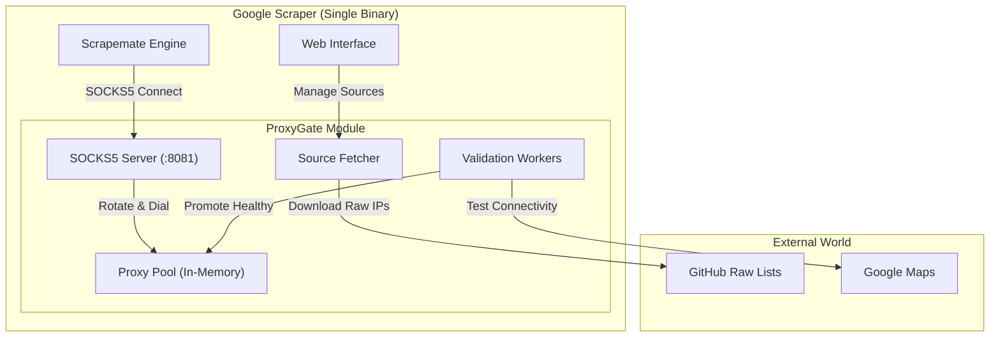

# ProxyGate: Self-Healing Proxy Gateway Design

**Date:** 2026-01-12
**Status:** Draft
**Issue:** #5

## 1. Overview
The **ProxyGate** system is an embedded proxy management module designed to solve the issue of unreliable static proxies. It acts as a local middleware server that automatically fetches, validates, and rotates free public proxies, presenting a stable SOCKS5 interface to the main scraper application.

## 2. Architecture

### 2.1 High-Level Component Diagram

### 2.2 Core Components

#### A. Fetcher (Source Manager)
- **Responsibility:** Periodically downloads raw proxy lists (SOCKS5/HTTP) from configured URLs.
- **Default Sources:**
    - `https://raw.githubusercontent.com/TheSpeedX/SOCKS-List/master/socks5.txt`
    - `https://raw.githubusercontent.com/monosans/proxy-list/main/proxies/socks5.txt`
    - `https://raw.githubusercontent.com/hookzof/socks5_list/master/proxy.txt`
    - `https://raw.githubusercontent.com/zloi-user/hideip.me/main/socks5.txt`
- **Config:** Stores list of source URLs in `config.json` or database.

#### B. Validator (Health Check)
- **Responsibility:** Filters raw IPs to ensure they are usable for Google Maps scraping.
- **Strategy (Two-Step):**
    1.  **Fast Ping:** Check connection to `google.com` (exclude dead hosts).
    2.  **Strict Verification:** Make a small HEAD/GET request to a Google Maps endpoint to verify the IP is not banned.
- **Concurrency:** Uses a worker pool (default 50-100 workers) to process thousands of IPs quickly.

#### C. Proxy Pool (Storage)
- **Structure:** Thread-safe Ring Buffer or Slice.
- **Logic:**
    - `GetNext()`: Returns the next healthy proxy (Round-Robin).
    - `ReportFailure(proxy)`: Temporarily quarantines or permanently removes a proxy if the scraper reports a timeout.

#### D. SOCKS5 Server
- **Protocol:** Standard SOCKS5 (No Auth required for local connection).
- **Binding:** `localhost:8081` (default).
- **Behavior:** Accepts connection from Scraper -> Handshakes -> Dials target using an upstream proxy from the Pool -> Pipes data.

## 3. Web UI Integration

A new **"Proxy Manager"** page will be added to the Web UI.

### 3.1 Features
- **Source Management:**
    - Add/Edit/Delete Source URLs.
    - Toggle "Active" status for sources.
- **Dashboard:**
    - **Total Proxies:** (e.g., 5,420)
    - **Healthy Pool:** (e.g., 42)
    - **Fetch Status:** "Last update 2 mins ago"
- **Actions:**
    - **"Fetch Now"**: Force trigger the fetcher.
    - **"Validate Now"**: Force re-check of the current pool.

### 3.2 API Endpoints
- `GET /api/proxygate/stats` - Returns pool statistics.
- `GET /api/proxygate/sources` - Returns list of sources.
- `POST /api/proxygate/sources` - Add new source.
- `DELETE /api/proxygate/sources/:id` - Remove source.
- `POST /api/proxygate/refresh` - Trigger refresh cycle.

## 4. Implementation Plan

### Phase 1: Backend Logic (Go)
1.  Create `internal/proxygate/` package.
2.  Implement `Fetcher` struct to download text files.
3.  Implement `Validator` with `http.Client` timeouts.
4.  Implement basic SOCKS5 server using `github.com/txthinking/socks5` or `armon/go-socks5`.
5.  Wire into `main.go`.

### Phase 2: Web UI (HTML/JS)
1.  Create `web/static/templates/proxies.html`.
2.  Add handlers in `web/web.go`.
3.  Connect Frontend to Backend API.

### Phase 3: Integration & Testing
1.  Run scraper with `-use-proxygate` flag.
2.  Verify IP rotation using `httpbin.org/ip`.
3.  Stress test with invalid proxies to ensure "Self-Healing" works.
